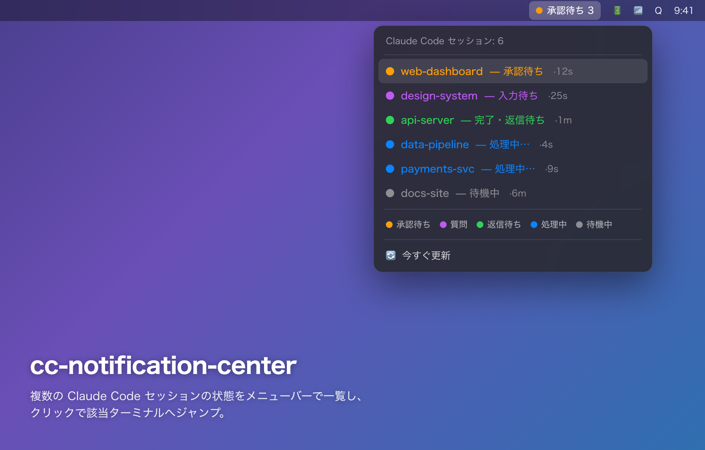

# cc-notification-center



複数の VSCode ウィンドウ／ターミナルで動いている **Claude Code セッションの状態を
メニューバーで一覧** し、クリックで該当の VSCode ターミナル/ウィンドウへジャンプするための仕組み。

> 上の画像はUIの再現イメージです。

> Monitor multiple Claude Code sessions across VSCode windows from your macOS menu bar,
> and click to jump straight to the right terminal — even across Spaces.

複数のプロジェクトを別々の VSCode ウィンドウ・複数ターミナルで Claude Code を走らせていると、
「どのセッションが承認待ち/返信待ちか」「それがどのウィンドウか」が分からなくなる。これを
**メニューバーのピクトグラム**で一目で把握し、**クリックでそのターミナルへ正確に移動**できる。

## 動作要件

- **macOS**
- **[SwiftBar](https://swiftbar.app)**（`brew install --cask swiftbar`。`install.sh` が自動導入）
- **Node.js**（メニューバー描画と VSCode 拡張で使用）
- **jq**（状態記録スクリプトで使用。`install.sh` が自動導入）
- **VSCode**（ターミナル/ウィンドウへのジャンプ機能に使う拡張のため。任意だが推奨）
- **Claude Code**（[hooks](https://docs.claude.com/en/docs/claude-code/hooks) で状態を取得）

リポジトリはどこに clone しても良い（`install.sh` が自身の位置からパスを解決する）。

```
[各 Claude Code セッション]
   │ hook (SessionStart / UserPromptSubmit / PostToolUse / Notification / Stop / SessionEnd)
   ▼
~/.claude/cc-notification-center/state/<session_id>.json   ← 状態の真実
   │                                   │
   ▼                                   ▼
SwiftBar プラグイン                (任意) 通知 hook
(メニューバー表示・クリックでジャンプ)   (macOS 通知 / Pushover 等・各自で設定)
   │ クリック → bin/cc-focus-session.sh
   ▼
~/.claude/cc-notification-center/focus-request.json
   │ (全 VSCode ウィンドウの拡張が監視)
   ▼
VSCode 拡張 cc-session-focus
  ・該当ターミナル(shell_pid 一致)を持つウィンドウだけが反応
  ・terminal.show() でタブをフォーカス
  ・open -a でそのウィンドウを前面化(別Space可・新規窓を作らない・~0.2s)
```

## なぜ VSCode 拡張なのか

外部スクリプト(AppleScript)だけでは、対象ターミナル/ウィンドウを正確に特定できない:
VSCode は全ターミナルが**単一 ptyHost を共有**しプロセスから辿れない・ウィンドウ
タイトルは**動的**でフォルダ名が出ないことがある・AX は**現在の Space のウィンドウ
しか見えない**・**マルチルート**だと1ウィンドウに複数プロジェクトが同居する。
そこで「全ウィンドウで拡張を動かし、該当ターミナルを持つウィンドウだけが自分を
前面化する」方式にした。ウィンドウ前面化は `open -a "Visual Studio Code" <target>`
を使う(起動中アプリへ Apple Event を送るだけ。`code` CLI より速く、別 Space でも届く)。

## メニューバーの見方

アイコンは **SF Symbols(ピクトグラム)** + 状態ラベル + 件数で表示する。
表示は「最も注意が必要な状態」(承認待ち > 入力待ち > 返信待ち > 処理中)。

| ピクトグラム(SF Symbol) | 色 | 表示例 | 意味 |
|---|---|---|---|
| `hand.raised.fill` | 橙 | ✋ 承認待ち n | ツール実行の許可待ち |
| `questionmark.circle.fill` | 紫 | ？ 質問 | Claude が質問して待っている |
| `checkmark.circle.fill` | 緑 | ✓ 返信待ち n | 応答完了・あなたの返信待ち |
| `arrow.triangle.2.circlepath` | 青 | ↻ 処理中 n | 処理中のセッション |
| `moon.zzz.fill` | 灰 | ⚪ 待機 | 待機中(見たが未返信) |
| `terminal` | 灰 | ⌨ CC | 稼働中セッションなし / 全て静観 |

(絵文字は文書上の近似。実物は単色のくっきりしたピクトグラム。)
配色や記号は `plugin/cc-render.js` の `META` で変更できる。
ドロップダウン末尾の「凡例」で全状態のピクトグラムを実物で確認できる。

クリックすると全セッションの一覧が開き、行をクリックすると該当 VSCode の
ターミナル/ウィンドウが前面化する。

## 構成ファイル

| パス | 役割 |
|---|---|
| `bin/cc-record-state.sh` | hook 本体。各イベントから状態(shell_pid 等)を `state/*.json` に記録 |
| `bin/cc-focus-session.sh` | メニュークリックから `focus-request.json` を書き出す |
| `bin/cc-clean-ghosts.sh` | 終了/クラッシュした(プロセス不在の)セッションの掃除(メニューから手動) |
| `bin/cc-cleanup-stale.sh` | ログイン時に「再起動で消えたセッション」の状態ファイルを自動掃除(LaunchAgent) |
| `vscode-extension/` | VSCode 拡張 cc-session-focus(ターミナル/ウィンドウの正確なジャンプ) |
| `plugin/cc-sessions.3s.sh` | SwiftBar プラグイン(3秒ごと更新)。node を探して描画を起動するラッパー |
| `plugin/cc-render.js` | メニューバー描画ロジック(状態 → SwiftBar 出力) |
| `install/patch-settings.js` | `~/.claude/settings.json` に hook を冪等に追記(バックアップ付) |
| `install.sh` | 一括セットアップ |
| `lib/focus-window.sh` | (旧)AppleScript 方式。拡張導入後は未使用。残置 |

状態ファイルは `~/.claude/cc-notification-center/state/` に置かれます。

## インストール

```bash
git clone https://github.com/mk0bayashi/cc-notification-center.git
cd cc-notification-center
bash install.sh
```

(リポジトリはどこに置いても良い。`install.sh` が自身の位置からパスを解決する。)

実行内容(何度実行しても安全):
1. 状態ディレクトリ作成
2. SwiftBar 導入(未導入なら `brew install --cask swiftbar`)
3. SwiftBar のプラグインフォルダ(`~/.swiftbar-plugins`)を設定し、プラグインを symlink
4. VSCode 拡張を `~/.vscode/extensions/local.cc-session-focus-0.1.0`(repo への symlink)に配置
5. `~/.claude/settings.json` に状態記録 hook を追記(`settings.json.bak.<日時>` を残す)
6. SwiftBar 起動

> 拡張は **各 VSCode ウィンドウで一度 `Developer: Reload Window`** すると有効化される
> (`terminals` API はウィンドウ毎なので全ウィンドウで動かす必要がある)。VSCode 全体の
> 終了→再起動は走っている Claude セッションを殺すので避ける。これから開くウィンドウは自動で有効。

## 状態の判定ロジック

| hook イベント | 状態 |
|---|---|
| `SessionStart` | ⚪ ready |
| `UserPromptSubmit` / `PostToolUse` | 🔵 working |
| `Notification` (permission_prompt) | 🟠 needs_permission |
| `Notification` (elicitation_dialog) | 🟣 needs_input |
| `Notification` (idle_prompt) | 🟡 idle |
| `Stop` | 🟢 waiting(返信待ち) |
| `SessionEnd` | state ファイル削除 |

クラッシュ等で `SessionEnd` が来なかったセッションは、記録した `claude_pid` の
生存確認(`kill -0`)で「終了/不明」と判定し、メニューから掃除できます。

### 🟢返信待ち と 🟡待機中 の違い(seen マーカー)

完了後の状態は、Claude Code の idle タイマーではなく **「該当ウィンドウを見たか」** で切り替える:

- 🟢 **返信待ち** = 完了したが、まだ該当 VSCode ウィンドウ(ターミナル)を**見ていない**。
- 🟡 **待機中** = 完了後、ウィンドウを一度**アクティブにした(見た)が未返信**。

仕組み:
- VSCode 拡張が、フォーカス中のアクティブターミナルについて `seen/<shell_pid>` を作成する。
- `cc-record-state.sh` は `Stop`(新しい完了)時に `seen/<shell_pid>` を削除する(=未読に戻す)。
- `cc-render.js` は完了系状態(waiting/idle)を、**seen マーカーが有れば待機中・無ければ返信待ち**
  として描画する。よって `idle_prompt` が来ても、見るまでは 🟢返信待ち を維持する。
- `shell_pid` が取れない場合は従来どおりタイマー挙動にフォールバックする。

## ジャンプの仕組みと精度

拡張が `shell_pid`(= claude の親シェル = VSCode の `terminal.processId`)でターミナルを
**正確に特定**するため、サブフォルダ/マルチルート/別 Space でも該当ターミナルへ飛べる。
ターミナルタブのフォーカス + ウィンドウ前面化まで行う。`shell_pid` が取れない場合は
shell integration の cwd でフォールバック照合する。

トラブル時のログ: `~/.claude/cc-notification-center/extension.log`
(`match` / `raised via open -a` / エラーが出る)。

## Mac 再起動後の挙動

- **SwiftBar**: ログイン項目に登録されるため自動起動(`install.sh` が登録)。
- **VSCode 拡張**: 再起動後に開いたウィンドウで自動ロード(`Reload Window` 不要)。
- **hook**: `settings.json` に永続。新しいセッションは普通に記録される。
- **前回のセッション**: 再起動で全て終了するため、ログイン時に LaunchAgent
  (`cc-cleanup-stale.sh`)が「OS 起動時刻より前の状態ファイル」を自動削除する。
  → 再起動直後はクリーンな状態で始まる。

## アンインストール

```bash
node install/patch-settings.js --remove                 # settings.json から hook を除去
rm ~/.swiftbar-plugins/cc-sessions.3s.sh                # プラグイン削除
rm ~/.vscode/extensions/local.cc-session-focus-0.1.0    # VSCode 拡張を除去(要 Reload Window)
launchctl unload ~/Library/LaunchAgents/com.cc-notification-center.cleanup.plist
rm ~/Library/LaunchAgents/com.cc-notification-center.cleanup.plist   # ログイン時掃除を除去
# SwiftBar 自体: brew uninstall --cask swiftbar
# SwiftBar をログイン項目から外す: システム設定 > 一般 > ログイン項目とスクリーンタイム
```

このツールは `~/.claude/settings.json` の hooks に自分のエントリを**追記するだけ**で、
他の hook には触れない(追記前に `settings.json.bak.<日時>` を残す)。

## 通知について

メニューバー表示が主機能。承認待ち/完了などを **デスクトップ通知やスマホ通知**でも
受け取りたい場合は、Claude Code の `Notification` / `Stop` hook に各自のスクリプト
(例: `osascript -e 'display notification ...'` や Pushover への POST)を追加する。
このリポジトリには個人依存の通知スクリプトは含めていない。
